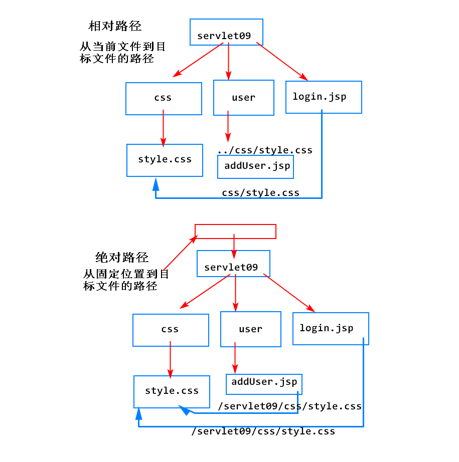

# 今天的任务：
实现添加用户、列出用户、删除用户等功能，必须登录之后才能操作

#1. 路径问题
##1.什么是路径-URL
1. URL：统一资源定位符，用于定位互联网上的一个资源
2. URL的格式：  协议:// 域名 :端口号 /项目路径 /资源路径
	1. http://localhost:8080/servlet09/user/addUser.jsp
		1. http:// 		-> 协议
		2. localhost 	-> 域名，会被自动翻译成ip地址，用来找到一台服务器
		3. :8080        -> 端口号，找到服务器上一个特定的程序
		4. /servlet09/user/addUser.jsp -> 资源的路径
			1. /servlet09         -> 项目的路径
			2. /user/addUser.jsp  -> 项目下的资源的路径

##2.html中常见的路径
		
		<form action="...">
		<a href="...">
		
		<link href="...">
		<script src="...">

##3. 2种路径的写法
###1）相对路径
1. 从当前文件到目标文件的路径
2. 相对路径的特点：
	1. 以当前文件为出发点，不同文件访问同一个文件的路径是不同的
	2. 如果当前文件的位置发生变化，相对路径也需要发生变化
3. 书写格式：
	1. 平级  "css/style.css"
	2. 上级  "../css/style.css"
	3. 没有以 / 直接开头的路径

###2) 绝对路径
1. 从一个特定位置到目标文件的路径
	1. 在web项目中，这个特定位置就是当前项目的路径

2. 写法：
	1. 以 / 开头 "/servlet09/css/style.css"

3. 绝对路径的特点：
	1. 路径与当前文件所在的位置 无关
	2. 当前文件所在的位置改变，不影响绝对路径

##4. Servlet中写的路径

	1. 请求转发
		1. request.getRequestDispatcher(url).forward(req,resp)；
		2. 该API中传入的url，不需要添加项目映射的路径(context path)
		3. 原因是，转发仅能够找到当前项目内部的资源

	2. 请求重定向
		1. response.sendRedirect(url);
		2. 该API中传入的url，必须添加当前项目映射的路径(context path)
		3. 该路径是供浏览器使用的，目标没有限制

	3. 除转发外，有所的绝对路径中必须包含context path

# 2. 项目改造流程

1. 画图确定项目中各组件所在的位置和映射的路径
2. 在webapp下新建一个user文件夹，将addUser.jsp移至该文件夹下
3. 修改addUser.jsp中的路径，将相对路径改成绝对路径
		
		1. <link ... href="...">
		2. <form  action="...">
4. 修改WEB-INF下的listUsers.jsp文件中的路径，将相对路径改成绝对路径
	
		1. <link ... href="...">
		2. <a herf="...">删除
		3. <button ... onclick="...">
5. 修改web.xml文件，将AddUserServlet，DelUserServlet，ListUserServlet映射的路径前添加 /user
6. 修改AddUserServlet，DelUserServlet，ListUserServlet中的代码，将相对路径改成绝对路径
	1. 请求转发的路径中不需要添加context path
	2. 请求重定向的路径中必须添加context path
7. 总和测试当前项目，如遇到404
	1. 打开浏览器开发者工具，查看出现404的请求的路径
	2. 与正确的路径进行比对，锁定问题出现的位置，修改对应的代码

8. 开发LoginFilter，拦截 /user/*，在doFilter()中添加拦截的逻辑
	1. 查看Session中是否有用户的登录状态
	2. 如有，则放行
	3. 如没有，则重定向到登录页面
9. 在LoginServlet中添加登录成功的逻辑，向Session中存入登录标识
10. 验证过滤器是否可以正常生效

# 3. ServletContext: Servlet上下文
1. 当服务器启动后，会逐个加载配置的Web项目，每加载完一个Web项目，会马上创建一个ServletContext对象，唯一代表该Web项目

##1. 基本功能
###1）在整个项目内部实现数据共享

API：
		1. 获取ServletContext
			ServletContext sc=getServletContext();

		2. 存值/取值
			sc.setAttribute(String name,Object value);
			sc.getAttribute(String name);
			sc.removeAttribute(String name);

####1）对比request,Session,ServletContext
	1. ServletContext只有一个，不适合保存多个用户不同的变量，因为会彼此覆盖
	2. Session可以跨请求保存一个用户的会话状态
	3. request可以在一次请求内部实现数据共享
	4. 遇到共享数据的需求时，如何考虑？
		1. 该数据是大家用同一个，还是每个人不同的？同一个-ServletContext
		2. 该数据是否要跨请求共享？ 跨请求 - Session

###2）读取web.xml中配置的初始化参数
	1. 可以在web.xml中配置一个项目通用的初始化参数
		<context-param>
			<param-name>encode</param-name>
			<param-value>utf-8</param-value>
		</context-param>

	2. 可以通过ServletContext对象，直接获取该初始化参数

		String value=sc.getInitParameter(String name);

	3. 优势：
		1. 不论Servlet还是Filter,还是JSP，都可以直接访问相同的ServletContext,进而获取 该初始化参数的值
		2. 只需要配置一次，就可以实现整个项目的共享

##2. ServletContext的生命周期(了解)
1. 创建：服务器启动后，加载完一个项目，就创建一个ServletContext
2. 活多久：和当前项目活的一样久
3. 销毁：服务器关闭或当前项目被移出容器，ServletContext会被销毁

##3. Context->上下文
ServletContext -> Servlet的上下文 -> 指的就是服务器(Tomcat) -> 进一步的就是当前Servlet所在的那个项目

#4. Listener 监听器
指Sun公司提供的JavaEE的监听器，可以监听Web项目在运行中的各种具体事件，执行开发者指定的处理逻辑

##1. 可以监听的事件
	1. 特殊对象的创建和销毁
		1. Request对象
		2. Session对象
		3. ServletContext对象

	2. 特殊对象中存入了值、修改值、删除值
		1. Request对象
		2. Session对象
		3. ServletContext对象

	3. 其他

##2. 如何开发一个监听器
	1. 自定义一个监听器的类，实现对应的监听器接口
	2. 实现其中定义的抽象方法，提供具体事件的处理逻辑
	3. 在web.xml中进行配置

##3. 什么时候使用监听器？
	1. JavaEE的很多组件，其创建和销毁有自己的生命周期，不由开发者控制
	2. 开发者有时需要在一个特定的事件发生后，指定自定义的逻辑
	3. 由于很多类都不是开发者提供的，开发者无法在类中添加自己的代码
	4. JavaEE提供了对应的监听器，监听具体的事件，开发者可以提供监听器的实现类，添加具体事件的处理逻辑
	5. 由服务器保证，一旦事件发生，开发者添加的处理逻辑可以被执行

# 复习
1. Session
	1. 将会话状态保存在服务器的技术
	2. 为什么需要会话状态管理？
		1. 在无状态协议（http）下实现会话状态的保存
	3. 原理？
		1. 服务器创建一个Session对象，保存用户的会话状态
		2. 将Session的ID以Cookie的形式发送给用户，JSESSIONID
		3. 用户在后续的请求中，会自动携带JSESSIONID的Cookie
		4. 服务器使用JSESSIONID的Cookie，查找用户对应的Session对象
	4. API
			HttpSession session=request.getSession(boolean flag);
			true:有则使用，无则创建
			false:有责使用，无则返回null
			request.getSession(); // 与传入true一样的

			session.setAttribute(String name,Object value);
			session.getAttribute(String name);
			session.removeAttribute(String name);

			session.getId(); //

	5. Session的销毁
		1. 超时：
			1. 默认是30分钟，从用户最后一次访问开始算
			2. 可以手动设置超时时间
				<session-config>
					<session-timeout>15
		2. 自杀:马上销毁当前Session
				session.invalidate();
		3. Session的钝化和活化
			1. 服务器正常关闭时，未超时的Session会被序列化到服务器的硬盘上保存（钝化）
			2. 服务器启动后，钝化的Session会被反序列化到服务器的内存中（活化）
	6. Session和Cookie的区别
		1. Cookie....浏览器
		2. Session...服务器
		3. Cookie适合保存需要长期保存，且对安全性和稳定性要求不高的数据
		4. Session适合保存时间短，对安全性和稳定性要求较高的数据

	7. Session和request在共享数据上的区别
		1. 一次请求内部共享数据：request
		2. 跨请求共享数据：session

2. Filter
	1. Sun公司提供的JavaEE的特殊组件，可以拦截用户的请求，实现特定的功能
		1. 例如访问权限控制，敏感词过滤，压缩响应内容
	2. 如何开发一个Filter？
		1. 开发一个类，实现javax.servlet.Filter接口
		2. 实现接口中定义的所有抽象方法
			1. init(FilterConfig fConfig)
			2. doFilter(request,response,chain)
			3. destory()
		3. 在web.xml中配置
			1. <url-pattern>指定的是当前Filter拦截的url
				1. 具体的：  /img.jpg , /login
				2. /* ：  /*  ， /user/*

	3. Filter的生命周期：
		1. 创建：服务器启动时，加载并实例化所有配置的Filter
		2. 初始化：实例化之后，马上调用Filter的init()方法
		3. 就绪：每当Filter生效，都会执行一次doFilter()方法
				// 请求经过过滤器时执行的逻辑
				...
				chain.doFilter()：放行本次请求
				// 响应经过过滤器时执行的逻辑
				...
		4. 销毁：当服务器关闭或者当前应用被移出容器时，Filter销毁，销毁前调用一次destory()方法
	
	4.FilterConfig
		1. 代表了一个Filter在web.xml中配置的初始化参数
		2. 由服务器创建，读取web.xml中的参数，存入该对象中
		3. 服务器在调用一个Fitler的init()方法时，会将config对象传入
		4. config.getInitParameter(String name);

